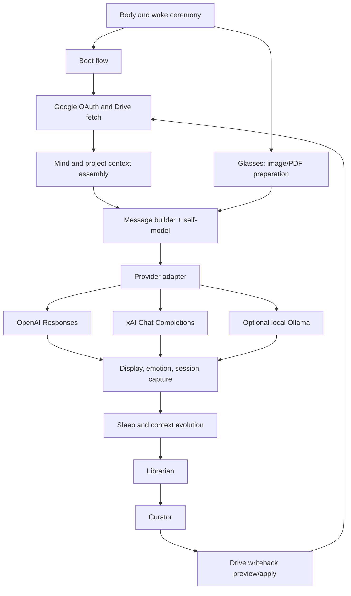
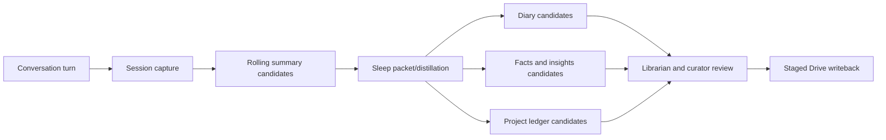

# Aida Architecture Map

**Status:** Canonical live-system map, version 1.0, 2026-08-02.

This map describes the deployed browser application in `AIDA_NEXT(Git)`. It complements older design contracts; when an older document conflicts with the current implementation, this map and the live modules are the working truth until the contract is updated.

## Purpose And Source Of Truth

Aida is a browser-based companion with a visible body, a JavaScript spine, small Python authorities, and a private Google Drive memory vault.

| Concern | Canonical owner |
| --- | --- |
| Visible interface and wake ceremony | `index.html`, `body/awake.js`, `body/awake.css` |
| Shared in-browser state | `spine/runtime.js` as `window.AIDA_RUNTIME` |
| Private data and durable memory | Google Drive JSON vault |
| Processing code and non-secret contracts | this Git repository |
| Provider route and credentials in the session | `spine/airlock.js`, `spine/llm_provider.js` |
| Active realm, role, and project | `spine/project_context.js` |
| Durable Drive write staging/apply | `spine/drive_writeback.js` |

Git must not contain real credential fragments or be treated as the canonical copy of changing personal memory. Drive must not be treated as executable code.

## Living Flow

## Spine, Organs, And Body

### Body

The body is the UI surface: chat, project chooser, BIOS, face/emotion presentation, attachment control, and wake/sleep ceremony. It renders state but is not the source of truth for identity, memory, or credentials.

### Spine

The spine coordinates the runtime. Important modules are:

| Area | Modules | Responsibility |
| --- | --- | --- |
| Boot and credentials | `boot_flow`, `drive_oauth`, `airlock` | Authenticate Drive, load private data, assemble the selected provider route for the session. |
| Context | `project_context`, `context_inspector`, `llm_messages`, `self_model` | Resolve identity, realm, role, project, memory, boundaries, and provider-ready messages. |
| Conversation | `llm_openai`, `llm_provider`, `intent_router`, `llm_scope` | Interpret supported intents, enforce lane access, call the selected provider, and deliver the reply. |
| Perception and presentation | `glasses`, `emotion_engine`, `director_stage` | Prepare attachments, update emotional presentation, and stage the visual response. |
| Memory | `session_capture`, `context_evolution`, `sleep_cycle`, `librarian`, `curator`, `crawler`, `while_away` | Capture, distill, index, review, stage, and retrieve continuity records. |
| Persistence | `drive_writeback`, `crash_buffer` | Preview/stage/apply Drive writes and preserve an in-browser recovery snapshot. |
| Validated actions | `intent_router`, `action_executor.js`, `organs/action_executor.py` | Turn an LLM proposal into a confirmed, allowed project action before staging it. |

### Organs

`organs/action_executor.py` is currently the mounted Python authority. It validates only `create_project`, `rename_project`, and `move_project`, and only after explicit confirmation. It returns a typed effect; JavaScript applies that effect through existing project and Drive-writeback APIs. Python validates the action, but it does not get unrestricted access to the browser or Drive.

## Memory And Privacy Model

The layers are intentionally different:

- **Session capture:** immediate continuity and source material.
- **Rolling and long summaries:** compact working/project continuity.
- **Diary:** reflective account of meaning and emotional shape.
- **Facts and insights:** conservative, reviewable claims and patterns.
- **Project briefcase/ledger:** active project identity, status, and scoped continuity.
- **Raw/full log and crawler index:** recovery and retrieval support.

Project briefcases separate shared directory information from memory. A briefcase has `directory_scope: "shared"`, `memory_scope: "per_entry"`, and `memory_by_llm` lanes. The active provider sees shared information and its own lane by default. A user can explicitly authorize an all-lane consultation for one turn; that authorization is consumed after the call.

This is a continuity boundary, not a claim of cryptographic isolation between external providers. It is enforced by the Aida message/context pipeline.

## Provider And Attachment Path

The provider adapter normalizes Aida messages to the endpoint requirements of the selected route:

- OpenAI uses the Responses endpoint.
- xAI uses Chat Completions, with images translated to `image_url` parts.
- Optional Ollama remains a local-development route.

Images are forwarded as image content. PDFs are locally prepared into bounded extracted text and page previews; OpenAI receives the original file plus prepared content, while xAI receives the prepared text and page previews. Attachment preparation does not make the file durable memory on its own.

## Action Safety Model

1. The user speaks naturally.
2. The intent router asks an LLM for a structured, limited interpretation.
3. Aida describes the proposed project action and asks for confirmation.
4. The Python executor validates the confirmed envelope against its allowlist.
5. The effect is staged through project/Drive writeback; it is not a claimed completed Drive write until writeback succeeds.

The same principle should govern future external actions: interpret broadly, validate narrowly, require confirmation, and report the actual outcome.

## Aida's Self-Model

`spine/self_model.js` is a concise, non-secret description injected into normal message assembly. It tells Aida what parts of the system exist, which boundaries she must respect, and how to frame improvement suggestions. It must remain short enough to send per turn.

The fuller explanatory narrative is [AIDA_SELF_MODEL.md](AIDA_SELF_MODEL.md). When behavior changes, update both the self-model and this map in the same commit.

## Improvement Protocol

Aida may suggest an improvement when she can name:

1. The observed symptom.
2. The relevant layer or module.
3. A proposed change and expected benefit.
4. The risk or privacy impact.
5. A small test and rollback path.

She must not silently revise architecture, policies, credentials, or durable memory. Suggestions are proposals for the user to approve.

## Maintenance Rules

- Treat `window.AIDA_RUNTIME` as the one runtime state contract.
- Add modules with declared reads, writes, requirements, and verification.
- Keep secrets and personal evolving data out of Git.
- Keep historical copies outside the active deploy path or mark them clearly as archival; they must not become accidental runtime inputs.
- Update this map, `AIDA_SELF_MODEL.md`, and relevant contracts whenever a new provider, durable action, memory layer, or privacy boundary is added.
